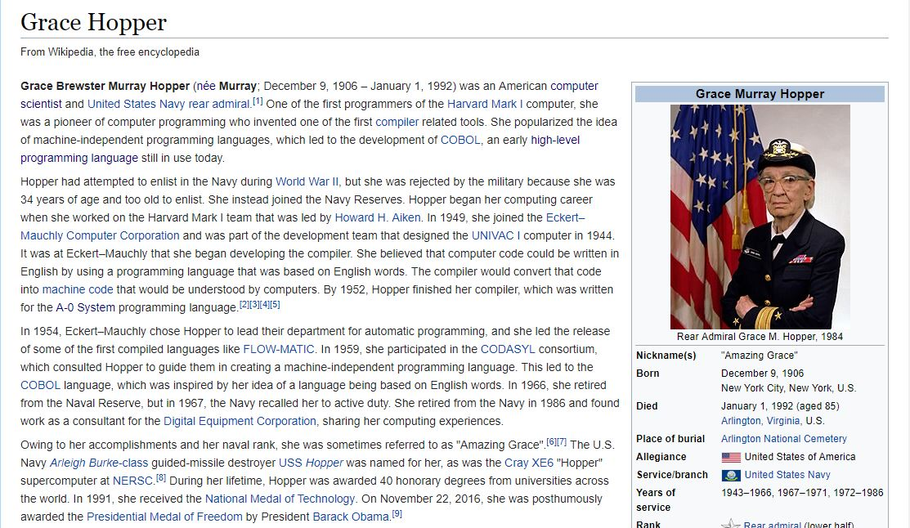

# Replicación de una página

## Objetivo
Este proyecto contiene una página web que es una réplica simple de la página __Grace Hopper__: <https://en.wikipedia.org/wiki/Grace_Hopper>.

## Herramientas
+ HTML5
+ CSS3

## Implementación

